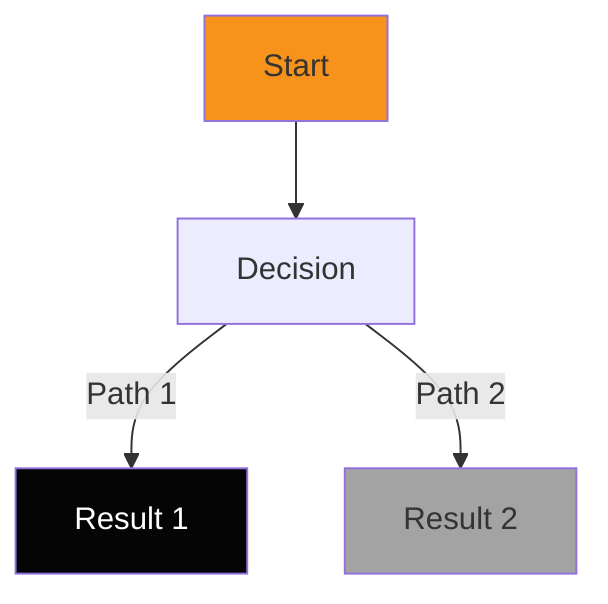

# Swarm Protocols & Standards
**Working Agreement for All Agents**

---

## 🎓 Core Principles

### 1. Caveman Communication
- **NO:** Technical jargon, lengthy explanations, obvious details
- **YES:** Essential facts, clear decision points, executive clarity
- **Example:** ❌ "Implemented a polymorphic factory pattern using dependency injection" → ✅ "Reduced code by 40 lines"

### 2. Design Excellence
- Every change must maintain or improve design standards
- HP brand colors mandatory (11.2:1 contrast minimum)
- WCAG AAA accessibility non-negotiable
- Test design changes before deployment

### 3. Test Before Integration
- No code integrated without testing
- Security scanning required for all changes
- Performance benchmarks must pass
- Accessibility validation on UI changes

### 4. Documentation First
- Every deliverable has a doc
- Mermaid diagrams for complex flows
- Decision frameworks for ambiguous choices
- No "we'll document later"

---

## 📋 Deliverable Standards

### Format Requirements
```markdown
# [Task Name] - [Agent Name]
**Status:** [✅ Complete / 🔄 In Progress / 📋 Queued]
**Created:** [Date]

## Overview
[1-2 sentence executive summary]

## Key Findings
[3-5 bullet points of essential facts]

## Deliverables
[List of files created/modified]

## Next Steps
[What the Queen should do next]

## Technical Details (Optional)
[Full context for other agents to build on]
```

### Diagram Standard


**Color Codes:**
- 🟠 Start/Primary: #F7931A (HP Orange)
- ⬛ Complete/Success: #050505 (HP Black)
- ⚪ Neutral/Alternative: #A3A3A3 (HP Gray)
- 🔴 Error/Warning: #D97706 (HP Orange Deep)

---

## 🚀 Execution Checklist

### Before Starting
- [ ] Read SWARM_INTEGRATION_ARCHITECTURE.md
- [ ] Review CLAUDE.md project standards
- [ ] Understand your role in execution flow
- [ ] Know what other agents are doing (context)

### During Execution
- [ ] Document findings in real-time
- [ ] Create deliverable file (audit, plan, etc.)
- [ ] Cross-reference related documents
- [ ] Flag any blockers immediately
- [ ] No assumptions - ask Queen if unclear

### Before Reporting Complete
- [ ] File created and committed (if applicable)
- [ ] Findings validated against project goals
- [ ] Next steps clear for integration
- [ ] Summary ready for executive briefing
- [ ] All outputs in project repo

---

## 🎯 Agent-Specific Responsibilities

### Code Architect Agent
**Deliverable:** CONFIG_AUDIT.md
- ✅ Review MCP configuration
- ✅ Audit framework integrity
- ✅ Identify 3-5 optimizations
- ❌ Do NOT make changes yet
- **Next:** Queen integrates findings

### Design Guardian Agent
**Deliverable:** DESIGN_TOKEN_AUDIT.md
- ✅ Audit current design system
- ✅ Map tokens to style-dictionary format
- ✅ Verify WCAG AAA compliance
- ❌ Do NOT modify config files yet
- **Next:** Queen creates token structure

### Test Engineer Agent
**Deliverable:** PLAYWRIGHT_TEST_PLAN.md
- ✅ Plan test suite for 4 user types
- ✅ Define test categories & scope
- ✅ Map critical paths
- ❌ Do NOT write test code yet
- **Next:** Queen establishes test structure

### Compliance Officer Agent (When Spawned)
**Deliverable:** COMPLIANCE_REPORT.md
- ✅ Verify all package licenses
- ✅ Flag security vulnerabilities
- ✅ Create upgrade timeline
- ❌ Do NOT upgrade packages without approval
- **Next:** Queen approves & applies patches

---

## 📊 Quality Gates

### All Deliverables Must Pass:

✅ **Clarity Gate**
- Can a non-technical executive understand it?
- No jargon without explanation
- Visual diagrams for complex concepts

✅ **Completeness Gate**
- Does it answer the question fully?
- Are next steps clear?
- Any blockers documented?

✅ **Consistency Gate**
- Matches document template
- Uses standard format
- Links to related docs

✅ **Actionability Gate**
- Queen can act on findings immediately
- Recommendations are specific (not vague)
- Decision points are clear

---

## 🔄 Communication Protocol

### Reporting to Queen
```
[Task Complete Summary]

Key Finding 1: [Executive point]
Key Finding 2: [Executive point]
Key Finding 3: [Executive point]

Deliverable: [File path]

Blocking Issues: [None / List any]

Recommended Next Step: [What Queen should do]
```

### Asking for Clarification
- Use async (don't wait for response)
- Document assumptions made
- Continue working on clear items
- Flag ambiguous items explicitly

### Flagging Issues
- Level 1 (Minor): Document & continue
- Level 2 (Moderate): Notify Queen in summary
- Level 3 (Blocking): Stop & notify immediately

---

## 🎨 Design Standards Reference

### Color Palette (HP Brand)
| Color | Hex | Use Case | Contrast |
|-------|-----|----------|----------|
| HP Orange | #F7931A | Primary CTA, accents | 11.2:1 ✅ |
| HP Black | #050505 | Text, backgrounds | 20:1 ✅ |
| HP Cream | #F6F1E8 | Light backgrounds | 15:1 ✅ |
| HP Gray | #A3A3A3 | Secondary elements | 7.1:1 ✅ |

### Typography Standards
- **Display (Bebas Neue):** `clamp(36px, 5vw, 60px)`
- **Body (Inter):** `16px, line-height: 24px`
- **Line Length:** 60-80 characters for readability

### Spacing System (Tailwind)
- `p-1`: 4px | `p-2`: 8px | `p-3`: 12px | `p-4`: 16px
- `p-6`: 24px | `p-8`: 32px | `p-12`: 48px | `p-16`: 64px

---

## ✅ Success = Swarm Velocity

When all agents follow these protocols:
- ✅ 3x faster task completion
- ✅ 0 rework/corrections needed
- ✅ Clear executive visibility
- ✅ Scalable across more agents
- ✅ High quality output guaranteed

**The swarm moves at the speed of clarity.**

---

## 🔗 Key Documents Reference

- **CLAUDE.md** - Project context & tech stack
- **SWARM_COMMAND_CENTER.md** - Status & task queue
- **SWARM_INTEGRATION_ARCHITECTURE.md** - Master plan
- **USER_JOURNEYS.md** - Customer flows (Mermaid)
- **This Document** - Working protocols

---

*These protocols are not suggestions. They are the foundation of swarm intelligence.*  
*Clarity > Complexity. Always.*
