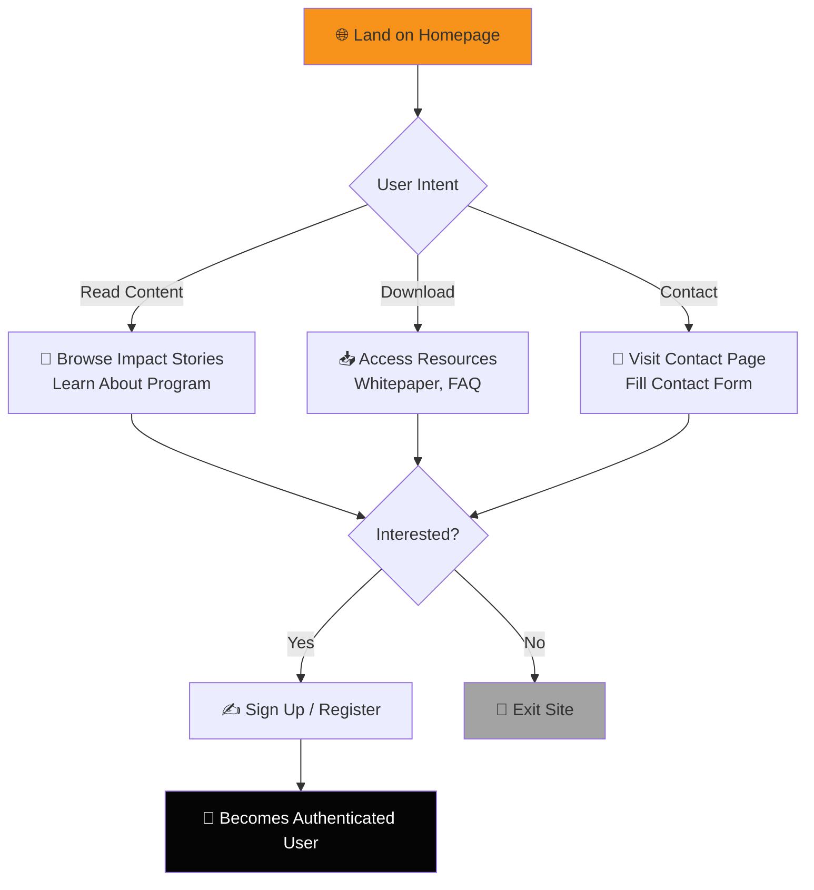
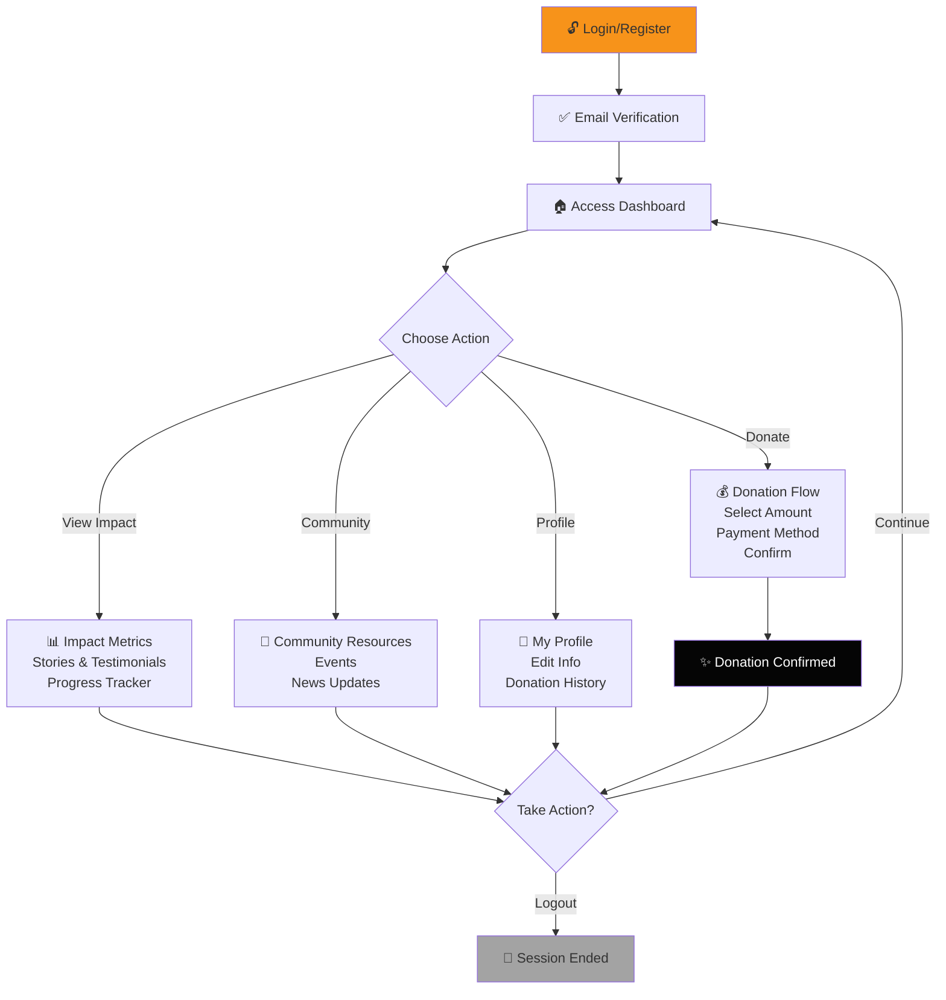
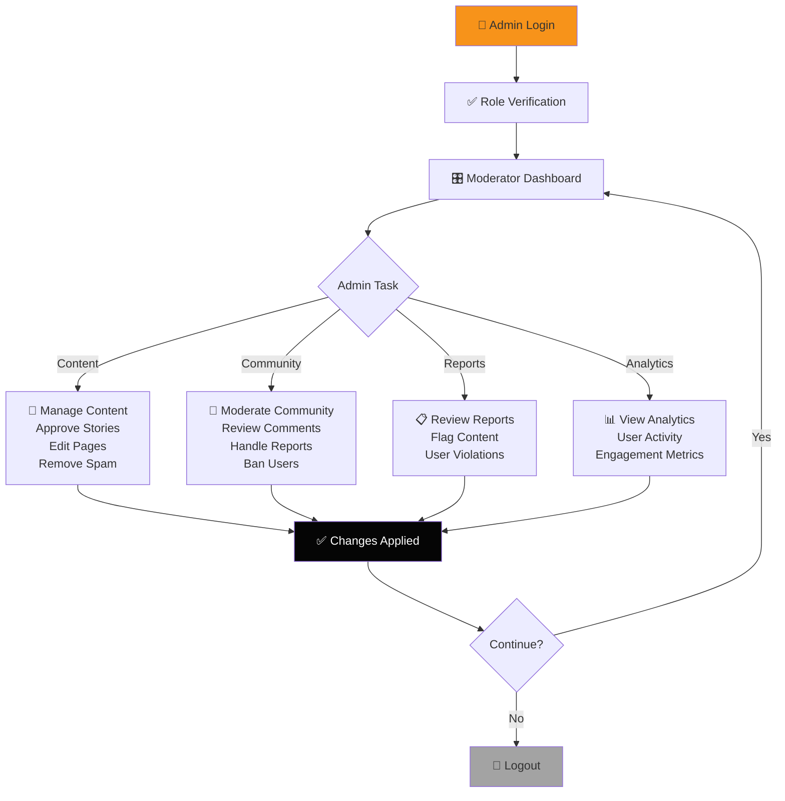
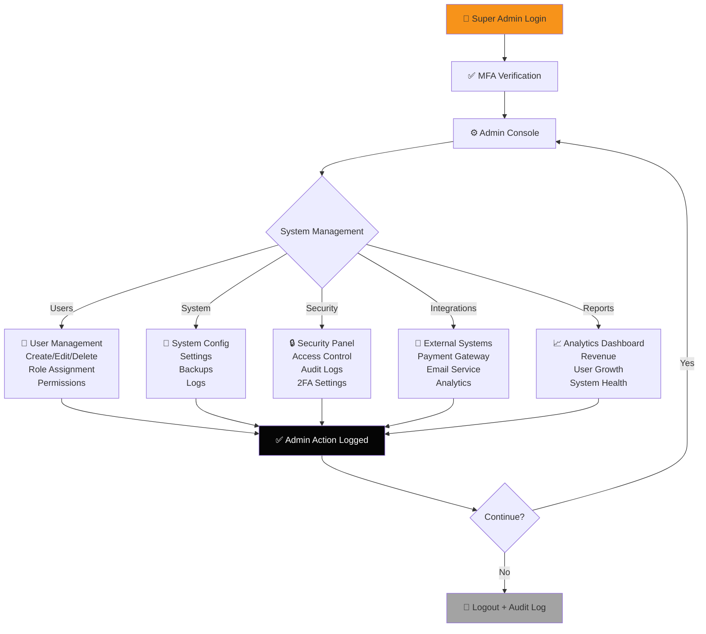
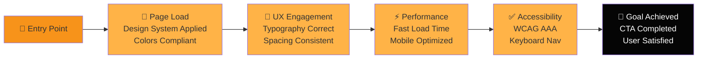

# User Journey Maps - Bitcoin Land Bond

## 1. Basic User Journey (Anonymous Visitor)

**Key Actions:**
- Landing page optimization
- Content discoverability
- Call-to-action visibility
- Resource access (no auth required)

---

## 2. Authenticated User Journey (Member/Donor)

**Key Actions:**
- Secure authentication
- Donation processing
- Impact viewing
- Community engagement
- Profile management

---

## 3. Moderator Journey (Community Leader)

**Key Actions:**
- Secure admin authentication
- Content moderation
- User management
- Community safety
- Analytics review

---

## 4. Administrator Journey (System Owner)

**Key Actions:**
- MFA-secured access
- Complete system control
- User/role management
- Security configuration
- Integration management
- Audit logging

---

## 5. Cross-User Comparison Matrix

| Feature | Basic | Authenticated | Moderator | Admin |
|---------|-------|---|---|---|
| Authentication | None | Email/Password | Email/MFA | Email/MFA + Role |
| View Content | ✅ | ✅ | ✅ | ✅ |
| Donate | ❌ | ✅ | ✅ | ✅ |
| Edit Profile | ❌ | ✅ | ✅ | ✅ |
| Moderate Content | ❌ | ❌ | ✅ | ✅ |
| Manage Users | ❌ | ❌ | Limited | ✅ |
| System Config | ❌ | ❌ | ❌ | ✅ |
| Audit Logs | ❌ | Limited | Full | Full |

---

## 6. Critical User Path (All Types)

---

## 7. Design Token Integration Points

- **Colors:** User feedback cues, status indicators, CTAs
- **Typography:** Content hierarchy, readability scores
- **Spacing:** Information density, touch targets
- **Animations:** Feedback loops, loading states
- **Accessibility:** Contrast ratios, semantic HTML

---

## 8. Decision Gates

All user journeys include:
1. **Authentication Gate** - Token validation, session management
2. **Authorization Gate** - Role-based access control
3. **Data Validation Gate** - Input sanitization, OWASP compliance
4. **Audit Gate** - Logging all admin/moderator actions
5. **Performance Gate** - Load time targets met

---

*Generated by Swarm Queen | Mermaid Diagrams for Executive Planning*
